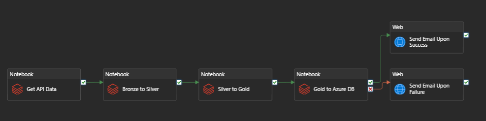
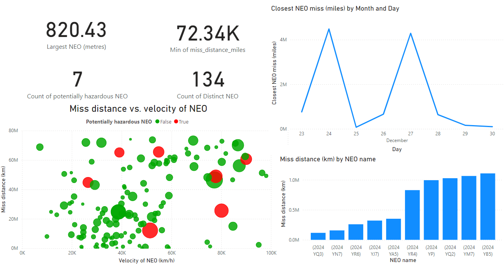

## Architecture


The pipeline comprises the following components:

1. **Azure Databricks (Python):**  
   - Ingests data from NASA's API, focusing on the last seven days of near-Earth object observations.  
   - Outputs raw data into Azure Blob Storage (bronze container).  

2. **Azure Blob Storage (Data Lake Gen2):**  
   - Stores data in bronze, silver, and gold containers following the medallion architecture.  

3. **Azure Databricks (Transformation):**  
   - Transforms data from bronze to silver to gold layers, applying necessary data cleansing, enrichment, and aggregations.  

4. **Azure Data Factory (Orchestration):**  
   - Triggers subsequent layer transformations (e.g., bronze → silver → gold) upon successful execution of each phase.  
   - Ensures all processed data is stored in Blob Storage.  
   - 

5. **Logic Apps (Notification):**  
   - Sends email notifications to a specific user upon the pipeline's success or failure, ensuring real-time updates on execution status.

6. **Azure Database for Analytics:**  
   - Stores the gold layer, serving as the data source for Power BI reporting.  

7. **Apache Airflow (Docker):**  
   - Orchestrates the entire process, running weekly DAGs that integrate with Azure Data Factory and ensure seamless automation.

## Features

- **Medallion Architecture:** Streamlined data lifecycle management (bronze → silver → gold).  
- **Automated Orchestration:** Fully automated weekly updates using Apache Airflow and Azure Data Factory.  
- **Scalable Storage:** Azure Data Lake Gen2 for reliable and scalable storage.  
- **Data Insights:** Power BI integration for interactive reporting and dashboards.  

---

## Setup and Prerequisites

### Prerequisites

- **Azure Account:** Access to Azure services (Blob Storage, Data Factory, Databricks, Database, App Registration).  
- **Docker:** Installed on your local machine to set up Apache Airflow.  
- **Python Environment:** Python 3.8+ for Databricks notebooks and Airflow configurations.  
- **API Key:** NASA API key for accessing near-Earth objects data.  

### Setup Steps

1. **Clone the Repository:**

   ```bash
   git clone https://github.com/your-repo-url.git
   cd your-repo-name

2. **Configure Apache Airflow:**

- Build the Docker image for Airflow:
    ```bash
    docker build -t airflow-nasa -f /path/to/your/Dockerfile .

- Start the Airflow containers using Docker Compose:
    ```bash
    docker-compose -f /path/to/your/dockercompose.yml up

3. **Deploy Azure Resources:**

- Create Blob Storage Containers:
    Set up bronze, silver, and gold containers in Azure Blob Storage.
- Set Up Databricks Workspace:
    Deploy notebooks for ingestion and transformation.
    Set variables to connect to Data Lake.
- Configure Azure Data Factory Pipelines:
    Build pipelines for triggering transformations and storing outputs.
- App Registration for Airflow and ADF Integration:
    1. Go to Azure Active Directory in the Azure portal.
    2. Register a new app and generate the following credentials:
       Client ID
       Tenant ID
       Client Secret
       Object ID
    3. Assign the required permissions to the app (e.g., access to Data Factory).
    4. Use these credentials to configure a connection between Airflow and ADF.

- Run the Pipeline:
    Trigger the Airflow DAG to initiate the weekly ELT process.

### Usage
1. Trigger Airflow DAG: Use the Airflow UI or CLI to trigger the DAG for the weekly update.
2. Monitor Progress:
    Monitor Airflow logs for orchestration.
    Check Azure Data Factory for transformation progress.
3. Access Reports: View the updated Power BI report based on the latest data in the gold layer eg 


### Future Improvements
- Integrate advanced alerting for failed DAGs or pipeline stages.
- Add data quality checks into the DAGs building on 